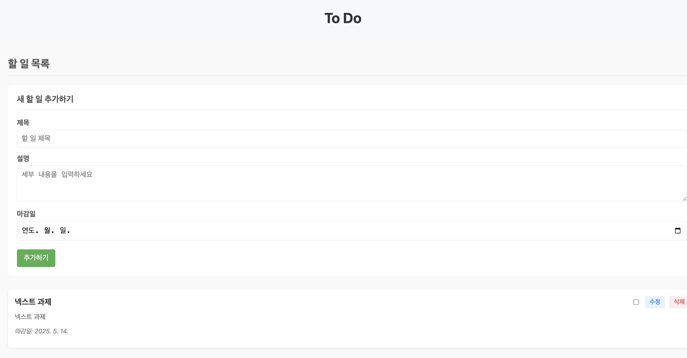
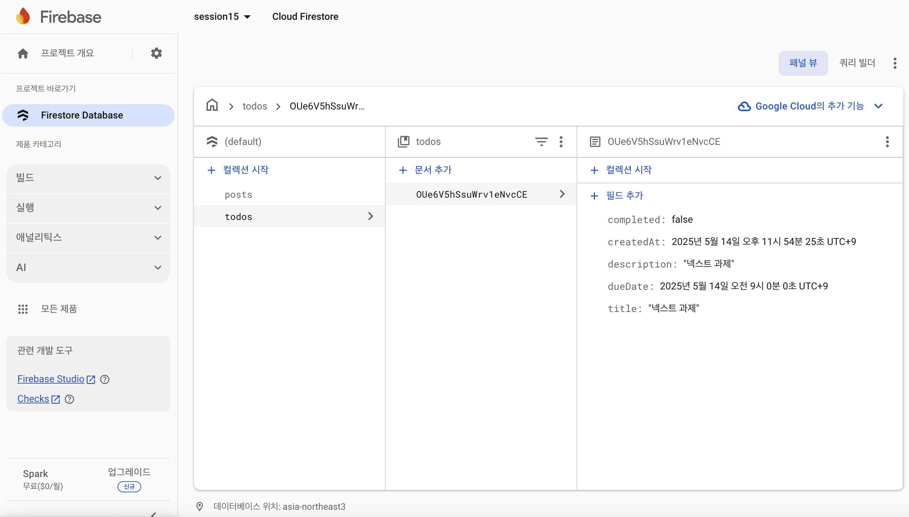

# React + Vite

This template provides a minimal setup to get React working in Vite with HMR and some ESLint rules.

Currently, two official plugins are available:

-   [@vitejs/plugin-react](https://github.com/vitejs/vite-plugin-react/blob/main/packages/plugin-react/README.md) uses [Babel](https://babeljs.io/) for Fast Refresh
-   [@vitejs/plugin-react-swc](https://github.com/vitejs/vite-plugin-react-swc) uses [SWC](https://swc.rs/) for Fast Refresh

# To Do 애플리케이션

Firebase Firestore를 사용한 할 일 관리 애플리케이션입니다.

## 주요 기능

-   할 일 목록 조회
-   새로운 할 일 추가
-   기존 할 일 수정
-   할 일 삭제
-   완료 상태 토글

## 스크린샷

### 홈 화면




## 기술 스택

-   React + Vite
-   Firebase Firestore
-   React Router
-   CSS

## 설치 및 실행

```bash
# 의존성 설치
npm install

# 개발 서버 실행
npm run dev
```

## 환경 변수 설정

`.env` 파일을 생성하고 다음 정보를 입력하세요:

```
VITE_FIREBASE_API_KEY=your_api_key
VITE_FIREBASE_AUTH_DOMAIN=your_auth_domain
VITE_FIREBASE_PROJECT_ID=your_project_id
VITE_FIREBASE_STORAGE_BUCKET=your_storage_bucket
VITE_FIREBASE_MESSAGING_SENDER_ID=your_messaging_sender_id
VITE_FIREBASE_APP_ID=your_app_id
```
